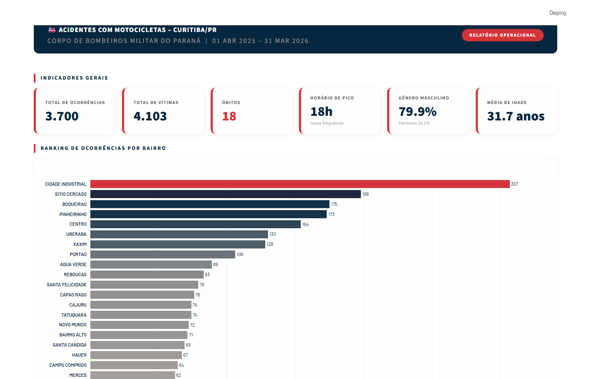
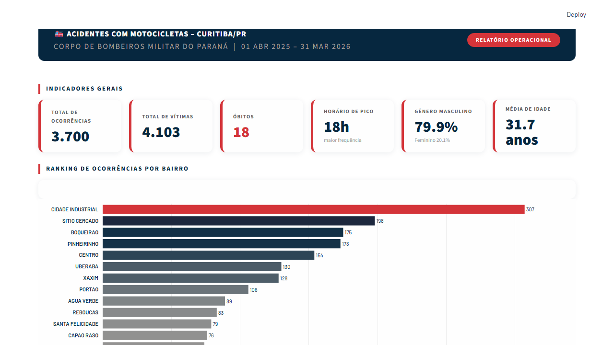

<div align="center">


# 🚒 Dashboard — Acidentes com Motocicletas | Curitiba/PR

**Relatório Operacional do Corpo de Bombeiros Militar do Paraná**  
Período de análise: **01/04/2025 a 31/03/2026**

</div>

---

## 📋 Sobre o Projeto

Dashboard interativo desenvolvido em **Python + Streamlit** para visualização e análise de dados de acidentes com motocicletas em Curitiba/PR, com base nos registros operacionais do **Corpo de Bombeiros Militar do Paraná (CBMPR)**.

O painel apresenta indicadores-chave, análises demográficas e geoespaciais que permitem identificar padrões de ocorrência, bairros críticos, perfil das vítimas e distribuição temporal dos acidentes.

---

## 📸 Preview



---

## 📊 Painéis e Visualizações

O dashboard é organizado em **6 blocos analíticos**:

| # | Painel | Descrição |
|---|--------|-----------|
| 1 | 🔢 **Cards KPI** | Indicadores gerais: total de ocorrências, vítimas, óbitos, horário de pico, gênero e média de idade |
| 2 | 🏙️ **Ranking por Bairro** | Gráfico de barras horizontal com os bairros com maior número de ocorrências |
| 3 | 🍩 **Gráfico Rosca** | Distribuição dos tipos de lesão (ileso, leve, grave, óbito) |
| 4 | 👥 **Pirâmide Etária** | Distribuição de vítimas por faixa etária e gênero (masculino/feminino) |
| 5 | 📈 **Linha Temporal** | Evolução mensal do número de ocorrências ao longo do período |
| 6 | 🗺️ **Mapa de Calor** | Mapa coroplético interativo de Curitiba com densidade de acidentes por bairro |

---

## 🗺️ Mapa Interativo

O mapa utiliza **Folium + GeoPandas** com os limites reais dos bairros de Curitiba (GeoJSON), exibindo:

- Coloração por intensidade de ocorrências (heatmap coropletótico)
- Popup com nome do bairro e total de acidentes ao clicar
- Integrado diretamente no Streamlit via `streamlit-folium`



---

## 🗂️ Estrutura de Arquivos

```
rotadavida/
│
├── dash.py                          # Aplicação principal (Streamlit)
├── requirements.txt                 # Dependências Python
│
├── Projeto_Final_Preenchido.csv     # Base de dados dos acidentes
├── Projeto_Final_Preenchido.xlsx    # Base de dados (formato Excel)
│
├── bairros_curitiba.geojson         # Limites geográficos dos bairros
├── DIVISA_DE_BAIRROS.*              # Shapefiles complementares
│
├── screenshot_full.png              # Preview do dashboard
└── screenshot_mapa.png              # Preview do mapa interativo
```

---

## ⚙️ Como Executar

### Pré-requisitos

- Python 3.10+
- pip

### 1. Clone o repositório

```bash
git clone https://github.com/dantamashiro-lab/rotadavida.git
cd rotadavida
```

### 2. Instale as dependências

```bash
pip install -r requirements.txt
```

### 3. Execute o dashboard

```bash
streamlit run dash.py
```

### 4. Acesse no navegador

```
http://localhost:8501
```

> ⚠️ **Atenção:** o arquivo `Projeto_Final_Preenchido.csv` deve estar na mesma pasta do script `dash.py`.

---

## 📦 Dependências

```txt
streamlit>=1.35.0
pandas>=2.0.0
plotly>=5.20.0
requests>=2.31.0
numpy>=1.26.0
geopandas>=0.13.0
folium>=0.14.0
st_folium>=0.10.0
```

---

## 🎨 Identidade Visual

O dashboard segue a **Paleta de Cores Oficial do CBMPR 2024**:

| Cor | HEX | Uso |
|-----|-----|-----|
| 🟦 Navy | `#062748` | Títulos, headers, gráficos principais |
| 🔴 Vermelho | `#C8102E` | Alertas, óbitos, destaque máximo |
| ⬜ Branco | `#FFFFFF` | Fundo dos cards |
| 🦧 Cinza Claro | `#F5F6FA` | Fundo da página |

---

## 📁 Dados Utilizados

| Campo | Descrição |
|-------|-----------|
| `num_ocorrencia` | Identificador único da ocorrência |
| `data` | Data do acidente |
| `hora` | Hora do acidente |
| `bairro` | Bairro onde ocorreu o acidente |
| `genero` | Gênero da vítima |
| `idade` | Idade da vítima |
| `lesao_cat` | Categoria da lesão (Ileso / Leve / Grave / Óbito) |

---

## 📌 Principais Indicadores (Período 04/2025 – 03/2026)

| Indicador | Valor |
|-----------|-------|
| Total de Ocorrências | **3.700** |
| Total de Vítimas | **4.103** |
| Óbitos | **18** |
| Horário de Pico | **18h** |
| Gênero Predominante | **Masculino (79,9%)** |
| Média de Idade | **31,7 anos** |
| Bairro com mais casos | **Cidade Industrial (307 ocorrências)** |

---

## 🛠️ Tecnologias

- **[Streamlit](https://streamlit.io/)** — Framework para criação de dashboards em Python
- **[Plotly](https://plotly.com/)** — Gráficos interativos (barras, rosca, pirâmide, linha)
- **[Folium](https://python-visualization.github.io/folium/)** — Mapas interativos baseados em Leaflet.js
- **[GeoPandas](https://geopandas.org/)** — Manipulação de dados geoespaciais
- **[Pandas](https://pandas.pydata.org/)** — Análise e tratamento de dados
- **[NumPy](https://numpy.org/)** — Operações numéricas

---

<div align="center">

Desenvolvido com ❤️ por <a href="https://github.com/dantamashiro-lab">dantamashiro-lab</a>

</div>
